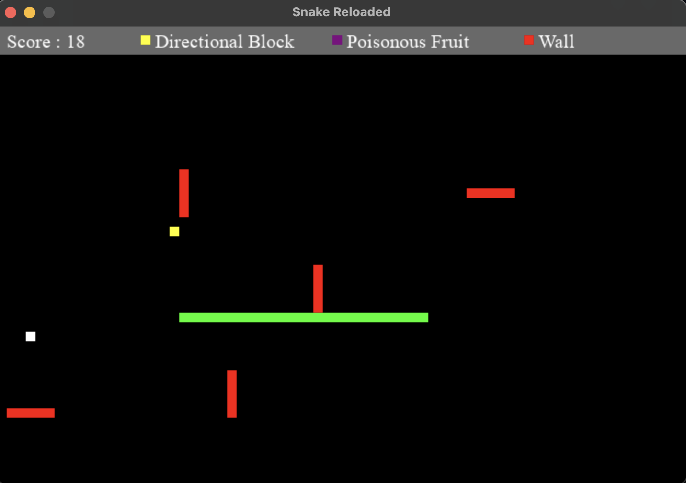
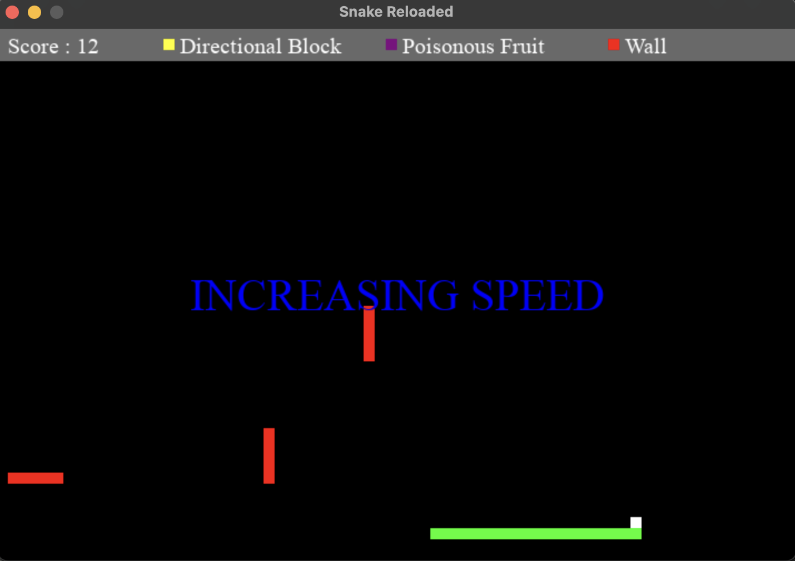
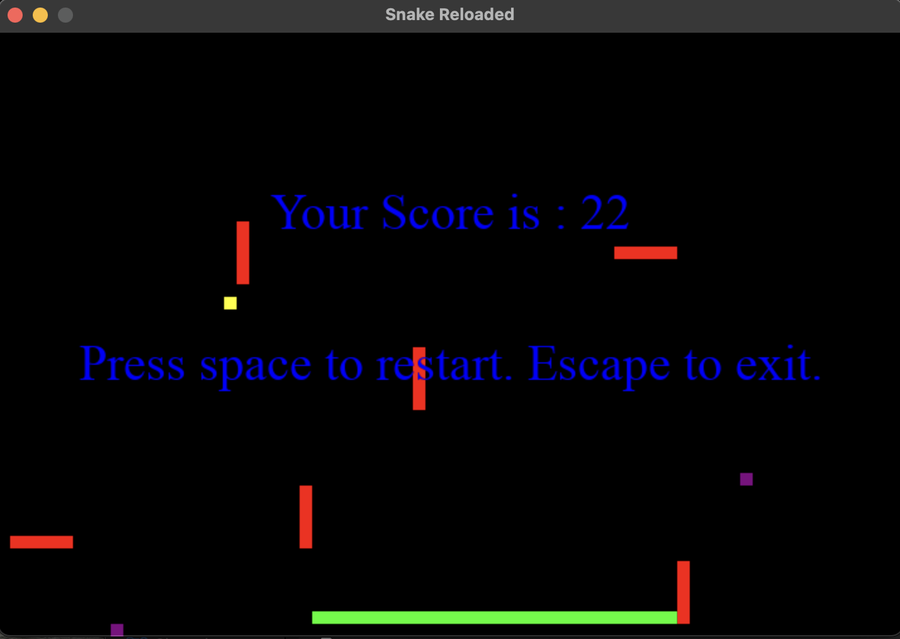

# Snake-Reloaded
A variant of the classic Snake game developed in Python using Pygame. This version includes various advanced features such as speed increases, wall additions, directional blocks, and poisonous fruits to keep the game challenging and fun.

## Table of Contents

- [Installation](#installation)
- [Usage](#usage)
- [Game Features](#game-features)
- [Screenshots](#screenshots)
- [Controls](#controls)
- [Configuration](#configuration)
- [License](#license)

## Installation

1. **Clone the repository**:
   ```sh
   git clone https://github.com/harshanand666/Snake-Reloaded.git
   cd Snake-Reloaded
   ```

2. **Install dependencies**:
   ```sh
   pip install -r requirements.txt
   ```

3. **Run the game**:
   ```sh
   python app.py
   ```

## Usage

- Run `app.py` to start the game.
- Use the arrow keys to control the snake.
- Collect fruits to grow in size and increase your score.
- Avoid running into the red walls and your own body.
- Watch out for poisonous fruits and other game elements that increase difficulty.

## Game Features
Periodically the game increases in difficulty by adding one of the following elements - 

- **Speed Increases**: The snake's speed increases by a certain amount.
- **Walls**: New red walls appear randomly to obstruct the snake's path.
- **Directional Blocks**: Special yellow blocks that force the snake to change direction upon collision.
- **Poisonous Fruits**: 2 Fruits spawn out of which one is poisonous. The poisonous fruit reduces the snake's size and score when eaten.

## Screenshots








## Controls

- **Arrow Keys**: Change the snake's direction.
- **Space**: Restart the game after a game over.
- **Escape**: Exit the game.

## Configuration

All game configurations are located in the `config.py` file. You can adjust various parameters such as:

- Window size
- Snake speed
- Wall size
- Difficulty settings
- Colors
- Fonts

## License

This project is licensed under the MIT License. 

